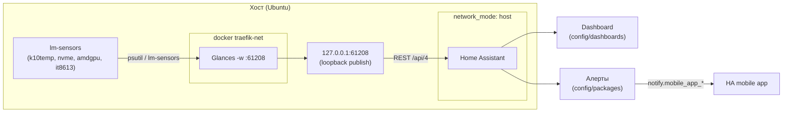

# feat: Здоровье железа сервера в Home Assistant через Glances

**Created:** 2026-06-29
**Type:** feat (мониторинг + алертинг)
**Depth:** Standard

---

## Summary

Вывести здоровье железа сервера (температуры CPU/NVMe/GPU/board + обороты вентиляторов IT8613E) из уже работающего Glances в Home Assistant: git-версионируемый дашборд с графиками и автоматизации-алерты с нотификацией в HA mobile app. Самый ценный алерт — не порог температуры, а **отказ вентилятора** (RPM = 0 при поднявшейся температуре).

Переиспользуем то, что уже есть: Glances крутится в web/REST-режиме (`glances -w`, `:61208`), а в `services/homeassistant/` уже заведён паттерн git-версионируемых `config/packages` (автоматизации) и `config/dashboards` (Lovelace YAML). Новой инфраструктуры (MQTT/Prometheus/Grafana) не поднимаем.

Главный технический затык — связность: Glances слушает `:61208` только в `traefik-net`, а Home Assistant на `network_mode: host`. Решаем публикацией порта на loopback хоста.

---

## Problem Frame

- **Что есть:** Glances (`services/glances/`) в режиме `-w`, REST API v4 на `:61208`, `pid: host`, уже читает `lm-sensors` и чистит вывод (`glances.conf`: прячет `Sensor 2`, алиасит Composite/CPU). Home Assistant (`services/homeassistant/`) на host-network, конфиг в `${APPDATA_PATH}/homeassistant`, плюс read-only mount'ы `config/packages` и `config/dashboards` под git-версионирование.
- **Чего нет:** данные железа не доходят до HA — нет графиков истории и нет алертов на перегрев/отказ вентилятора.
- **Корневая проблема связности:** Glances `:61208` опубликован только в `traefik-net`; HA на host-network в этой сети не состоит → напрямую до API не достучаться.
- **Подтверждено по исходникам HA:** интеграция Glances отдаёт `fan_speed` (RPM, `state_class=measurement`) нативно — fallback нужен только если Glances API не вернёт `fan_speed` для it8613.

---

## Requirements

- **R1.** Метрики железа (температуры CPU `k10temp`, NVMe `Composite`, GPU `amdgpu`, board + обороты `fan2`/`fan3` IT8613E) доступны как сущности HA с историей (`state_class=measurement`).
- **R2.** HA (host-network) достаёт Glances REST API через порт, опубликованный **только на loopback хоста** (`127.0.0.1:61208`) — без экспозиции неаутентифицированного Glances в LAN.
- **R3.** Автоматизации шлют нотификацию в **HA mobile app** при: (a) превышении температурных порогов CPU/NVMe; (b) **отказе вентилятора** (RPM = 0 при поднявшейся температуре).
- **R4.** Дашборд с графиками температур и оборотов — git-версионируемый Lovelace YAML.
- **R5.** Алерты и дашборд лежат в git (`config/packages`, `config/dashboards`) — воспроизводимо, не только в UI.
- **R6.** Если Glances API не отдаёт `fan_speed` для it8613 — задокументированный fallback обеспечивает обороты для fan-failure алерта.

---

## Key Technical Decisions

- **Нативная интеграция HA Glances, не своя инфраструктура.** Glances уже работает и читает все нужные сенсоры; HA-интеграция отдаёт и температуры, и `fan_speed` (RPM) — [подтверждено в `homeassistant/components/glances/sensor.py`](https://github.com/home-assistant/core/blob/0b7e2fa28b775d0189b33dcce889f15e1c4ce7a7/homeassistant/components/glances/sensor.py). MQTT/Prometheus/Grafana — оверкилл.
- **Связность через loopback-публикацию порта.** `ports: ["127.0.0.1:61208:61208"]` в compose Glances. HA на host-network читает `127.0.0.1:61208`. Привязка к loopback (не `0.0.0.0`) — чтобы не плодить неаутентифицированный Glances-эндпоинт в LAN. _(Альтернатива — направить HA на Traefik-vhost `glances.home.local:80`; отклонена: лишний хоп через reverse-proxy для внутренней интеграции, зависимость от Host-header роутинга.)_
- **Подключение интеграции — одноразовый UI-шаг (config-flow).** Интеграция Glances в HA только config-flow (не YAML), хранится в `.storage`. Это разовая ручная операция; всё, что МОЖНО версионировать (алерты, дашборд), уходит в git через существующие mount'ы.
- **Fan-failure через `RPM = 0 AND temp > N` с дебансом `for:`.** Простой порог температуры не ловит сдохший вентилятор рано; связка «обороты упали + температура есть» ловит. `for:` гасит дребезг.
- **Fallback под обороты — условный, по результату проверки.** Если `curl 127.0.0.1:61208/api/4/sensors` не содержит `fan_speed` для it8613 (психология psutil/контейнерного доступа к hwmon) — `command_line`-сенсор HA, читающий `sensors -j` по SSH с хоста. Включается только при провале проверки в U2.

---

## High-Level Technical Design

Поток данных и связность (host vs traefik-net — ключевой нюанс):

---

## Implementation Units

### U1. Опубликовать Glances REST API на loopback хоста

**Goal:** дать HA сетевой доступ к Glances API, не экспонируя его в LAN.
**Requirements:** R2.
**Dependencies:** нет.
**Files:**

- `services/glances/docker-compose.yml` — добавить `ports: ["127.0.0.1:61208:61208"]`.

**Approach:** Glances остаётся в `traefik-net` (локальный/внешний web-UI через Traefik не ломаем), плюс публикуем сырой порт только на loopback. Привязка `127.0.0.1` обязательна — `0.0.0.0` открыл бы неаутентифицированный Glances всей LAN.

**Patterns to follow:** существующий compose Glances; стиль публикации портов других сервисов в `services/`.

**Test scenarios:**

- `Covers R2.` После `./scripts/docker/rebuild.sh glances` — `curl -s http://127.0.0.1:61208/api/4/status` отвечает 200 с хоста.
- С другой машины в LAN `curl http://192.168.1.41:61208/` **не** отвечает (порт только на loopback).

**Verification:** `ss -tlnp | grep 61208` показывает bind на `127.0.0.1:61208`, не `0.0.0.0`.

---

### U2. Проверить набор сенсоров в API и подключить интеграцию Glances в HA

**Goal:** убедиться, что API отдаёт нужные температуры **и** `fan_speed`, затем подключить интеграцию и получить сущности с историей.
**Requirements:** R1, R6 (гейт).
**Dependencies:** U1.
**Files:** нет (проверка API + одноразовый config-flow в UI; шаги — в README, см. U6).

**Approach:**

- Проверка API: `curl -s http://127.0.0.1:61208/api/4/sensors` — найти записи `"type": "temperature_core"/"temperature_hdd"` (k10temp/nvme/amdgpu) и **`"type": "fan_speed"`** для it8613 (`fan2`/`fan3`).
- Если `fan_speed` отсутствует (контейнерный psutil не видит hwmon it8613) — `./scripts/docker/rebuild.sh glances` (драйвер it87 грузился после старта контейнера); перепроверить. Если и после рестарта пусто — это **гейт на U5** (fallback).
- Подключить интеграцию: Settings → Devices & Services → Add → **Glances** → host `127.0.0.1`, port `61208`. Создаются `sensor.*` для температур и (если есть) оборотов.

**Test scenarios:**

- `Covers R1.` В Developer Tools → States видны сущности температур (`sensor.homelab_*_temperature`) с числовыми значениями.
- `Covers R1.` Видны сущности оборотов (`*_fan_speed`, unit RPM) для `fan2`/`fan3` — ИЛИ зафиксирован их отсутствие → активировать U5.
- У температурных сущностей в атрибутах `state_class: measurement` (пишутся в long-term statistics).

**Verification:** записать фактические `entity_id` температур и оборотов — они нужны как вход для U3/U4. Решение по гейту U5 зафиксировано (fan_speed есть / нет).

_Execution note: точные `entity_id` зависят от лейблов Glances и слугификации HA — определяются здесь и подставляются в U3/U4 вместо плейсхолдеров._

---

### U3. Git-версионируемые алерты (packages) с нотификацией в mobile app

**Goal:** автоматизации на перегрев и отказ вентилятора, шлющие в HA mobile app.
**Requirements:** R3, R5.
**Dependencies:** U2.
**Files:**

- `services/homeassistant/config/packages/hardware-health.yaml` — automations: пороги температур + fan-failure.
- `${APPDATA_PATH}/homeassistant/configuration.yaml` — одноразово включить `homeassistant: { packages: !include_dir_named packages }` (если ещё не включено; см. README сервиса).

**Approach:**

- Триггеры `numeric_state` с `for:` (антидребезг). Пороги под железо:

  | Сенсор | Warning | Critical |
  | --- | --- | --- |
  | CPU `k10temp Tctl` | >85°C, 5 мин | >95°C |
  | NVMe `Composite` | >70°C | >80°C (крит диска 88.8) |
  | Board `it8613 temp3` | >65°C | >75°C |

- Fan-failure: `fan2` ИЛИ `fan3` `== 0` RPM **И** CPU temp > ~50°C, `for: 2min` → critical-нотификация. Это ключевой алерт.
- Действие — `notify.mobile_app_<device>` (точное имя сервиса зафиксировать из HA; вынести в плейсхолдер/переменную).

**Patterns to follow:** HA package-формат (объединяет `automation:`/`template:` в одном файле); существующая структура `config/packages` (README сервиса).

**Test scenarios:**

- `Covers R3.` Ручной прогон автоматизации (Developer Tools → Actions / trigger) → приходит пуш в mobile app.
- Fan-failure: симулировать через `input_number`/template-override или `numeric_state` тест — при RPM=0 и temp>порог срабатывает critical; при RPM>0 не срабатывает.
- Дебанс: кратковременный выброс выше порога < `for:` нотификацию НЕ шлёт.
- Невалидное состояние сенсора (`unavailable`/`unknown`) не роняет автоматизацию и не шлёт ложный алерт.

**Verification:** `ha core check` (config valid); тестовый прогон каждой автоматизации даёт пуш; YAML лежит в git.

---

### U4. Git-версионируемый дашборд с графиками

**Goal:** Lovelace-дашборд с историей температур и оборотов.
**Requirements:** R4, R5.
**Dependencies:** U2.
**Files:**

- `services/homeassistant/config/dashboards/hardware-health.yaml` — Lovelace YAML.
- `${APPDATA_PATH}/homeassistant/configuration.yaml` — одноразово включить YAML-dashboard (см. README сервиса).

**Approach:**

- Базово — `history-graph`/`statistics-graph` карточки по температурам (CPU/NVMe/GPU/board) и отдельная по `fan2`/`fan3`.
- Опционально (если есть HACS) — `custom:apexcharts-card` одним мульти-линейным графиком; в плане НЕ закладываем зависимость от HACS, ApexCharts — улучшение.
- Сущности — фактические `entity_id` из U2.

**Patterns to follow:** YAML-mode Lovelace из README сервиса; существующий формат `config/dashboards`.

**Test scenarios:**

- `Test expectation: none — presentation-only.` Проверка: дашборд открывается, карточки рисуют ненулевую историю после накопления данных (минуты).

**Verification:** дашборд виден в HA, графики заполняются; YAML в git.

---

### U5. (Условно) Fallback оборотов через SSH, если Glances не отдаёт fan_speed

**Goal:** обеспечить обороты для fan-failure алерта, если интеграция Glances их не показала.
**Requirements:** R6.
**Dependencies:** U2 (активируется ТОЛЬКО если гейт U2 показал отсутствие `fan_speed`).
**Files:**

- `services/homeassistant/config/packages/hardware-health.yaml` — добавить `command_line` сенсоры оборотов.

**Approach:**

- `command_line`-сенсор HA выполняет по SSH с хоста `sensors -j it8613-isa-* | jq` → `fan2`/`fan3` RPM. Требует SSH-доступа из контейнера HA к хосту (ключ; хост на host-network — `127.0.0.1`).
- Эти сенсоры подменяют источник оборотов в fan-failure автоматизации (U3).

**Patterns to follow:** HA `command_line` sensor; стиль packages из U3.

**Test scenarios:**

- `Covers R6.` Сенсор возвращает RPM, совпадающий с `sensors` на хосте; при остановленном вентиляторе → 0.
- Таймаут/ошибка SSH → сенсор `unavailable`, fan-failure автоматизация это переживает (не ложный алерт).

**Verification:** обороты видны в HA как сущности; fan-failure алерт работает на их основе.

_Этот юнит — no-op, если U2 подтвердил нативный `fan_speed`. Тогда он уходит в Deferred._

---

### U6. Документация

**Goal:** зафиксировать настройку для воспроизводимости.
**Requirements:** R5.
**Dependencies:** U3, U4 (и U5 при активации).
**Files:**

- `services/homeassistant/README.md` — раздел: интеграция Glances (host `127.0.0.1:61208`), включение packages/dashboard, таблица порогов, путь fallback.
- `ENVIRONMENT.md` — короткая ссылка из секции мониторинга/железа (мониторинг температур/оборотов в HA через Glances).

**Approach:** описать одноразовые UI-шаги (config-flow, включение include в `configuration.yaml`) и git-версионируемую часть.

**Test scenarios:** `Test expectation: none — документация.`
**Verification:** README позволяет повторить настройку с нуля.

---

## Scope Boundaries

**В плане:**

- Связность HA↔Glances через loopback-публикацию `:61208`.
- Сущности температур + оборотов в HA с историей.
- Git-версионируемые алерты (пороги + fan-failure → mobile app) и дашборд.
- Условный SSH-fallback под обороты.

**Deferred to Follow-Up Work:**

- U5, если U2 подтвердит нативный `fan_speed` от Glances.
- ApexCharts/HACS-карточки (улучшение поверх штатных графиков).
- Алерты по не-температурным метрикам (диск/RAM/CPU-load), SMART NVMe, UPS-события в HA.

**Out of scope:**

- Управление вентилятором из HA (обороты — read-only; кривой рулит EC, см. `ENVIRONMENT.md`).
- Новая инфраструктура мониторинга (MQTT/Prometheus/Grafana).

---

## Risks & Dependencies

- **Glances-контейнер не видит hwmon it8613** → нет `fan_speed`. Mitigation: рестарт Glances (драйвер грузился позже старта контейнера); при провале — U5 (SSH-fallback). Проверяется в U2 до написания алертов.
- **Неаутентифицированный Glances на опубликованном порту** → mitigation: bind строго на `127.0.0.1`, проверка из LAN в U1.
- **Точные `entity_id`** зависят от лейблов Glances/слугификации HA — определяются в U2, плейсхолдеры в U3/U4 заменяются фактическими.
- **Имя сервиса `notify.mobile_app_<device>`** зависит от устройства — зафиксировать из конкретного HA при U3.
- **Включение packages/dashboard** требует разовой правки `configuration.yaml` в appdata (не git) — операционный шаг, отражён в U3/U4/U6.

---

## Sources & Research

- HA Glances integration отдаёт `fan_speed` (RPM, `state_class=measurement`) нативно: [`homeassistant/components/glances/sensor.py`](https://github.com/home-assistant/core/blob/0b7e2fa28b775d0189b33dcce889f15e1c4ce7a7/homeassistant/components/glances/sensor.py).
- Текущие конфиги: `services/glances/docker-compose.yml` (`-w`, `:61208`, `pid: host`, `traefik-net`), `services/glances/glances.conf` (hide `Sensor 2`, алиасы), `services/homeassistant/docker-compose.yml` (`network_mode: host`, mount'ы `config/packages` + `config/dashboards`), `services/homeassistant/README.md`.
- Железо/сенсоры: `ENVIRONMENT.md` → «Управление вентиляторами (IT8613E)», «Известные проблемы железа» (Kingston Sensor 2).

---

## Verification Contract

- `curl http://127.0.0.1:61208/api/4/sensors` возвращает температуры **и** `fan_speed` (или зафиксирован запуск U5).
- Glances-порт слушает только loopback (`ss -tlnp`).
- В HA есть сущности температур и оборотов с историей.
- Каждая автоматизация при тестовом прогоне шлёт пуш в mobile app; fan-failure срабатывает на RPM=0+temp, дребезг гасится `for:`.
- Дашборд рисует историю.
- Алерты + дашборд в git; README воспроизводит настройку.

## Definition of Done

R1–R6 выполнены: данные железа (вкл. обороты — нативно или через fallback) в HA с историей и графиками; алерты на перегрев и отказ вентилятора уходят в mobile app; вся версионируемая часть в git; разовые UI/appdata-шаги задокументированы.
