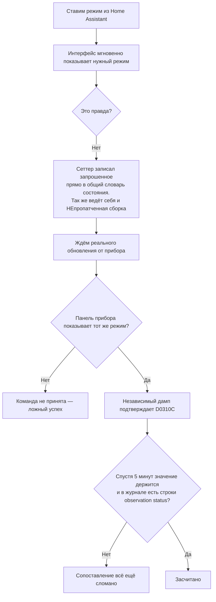

# fix: чтение режима Philips AC3737/10 при работающем увлажнении + отправка правки upstream

## Product Contract

### Summary

Починить локально чтение режима вентилятора у Philips AC3737/10, убедиться наблюдением у прибора, что переключение режимов не сломалось, снять сырые дампы состояния для публикации и отправить правку в upstream-репозиторий `kongo09/philips-airpurifier-coap`.

---

### Problem Frame

**Прибор.** Philips AC3737/10 — очиститель воздуха и увлажнитель «2 в 1» (серия Carnation), прошивка 1.0.4, живёт в спальне, подключён к Home Assistant через установленную из HACS интеграцию `philips_airpurifier_coap` (общается с прибором по зашифрованному протоколу CoAP в локальной сети).

**Симптом.** Пока увлажнение работает, Home Assistant не знает, в каком режиме вентилятор: атрибут `preset_mode` у сущности `fan.bedroom_air_cleaner_and_purifier` равен `null`. Команды при этом проходят — прибор переключается.

**Причина.** В upstream-файле `custom_components/philips_airpurifier_coap/philips.py` класс `PhilipsAC3737` описывает каждый режим словарём «поле прибора → ожидаемое значение». В каждом словаре три поля: `D03102` (питание), `D0310A` и `D0310C`. Свойства `preset_mode` и `percentage` требуют совпадения **всех** полей и выходят из сравнения на первом же несовпавшем. Поле `D0310A` при этом не имеет отношения к режиму вентилятора: в файле `const.py` того же репозитория оно объявлено бинарным сенсором «увлажнение активно» с условием `значение == 4`. Наш прибор во время увлажнения репортит `D0310A = 4`, а класс ждёт 2 (авто, сон, скорости) или 3 (турбо). Совпадение не наступает никогда.

**Что мы уже проверили на этом приборе.** В `services/homeassistant/README.md` записаны результаты прошлых опытов, и они и есть исходное доказательство:

- при работающем увлажнении режим не читается ни в одном положении;
- при снятом модуле увлажнения авто читается как `auto`, сон как `sleep`, скорости 1 и 2 дают `percentage` 50 и 75;
- турбо не читается **даже на сухую** — из чего следует, что в турбо `D0310A` не равен тройке, которую ждёт класс.

То есть диагноз на нашем экземпляре подтверждён. Сырые дампы (U2) нужны не чтобы это выяснить, а чтобы отдать наверх числа в том же виде, в каком их привёл владелец другого экземпляра.

**Чем это вредит на практике.** Автоматизации в `services/homeassistant/config/packages/philips_ac3737.yaml` перед отправкой команды проверяют «текущий режим отличается от нужного» (строки 49, 89, 135, 182). При неизвестном режиме проверка всегда истинна и команда уходит всегда, а прибор пищит на каждую принятую команду. Конкретно уходит впустую: тройной повтор при перезапуске Home Assistant (`ac3737_reconcile_mode`) и холостая переотправка после очистки воздуха (`ac3737_restore_after_clean`). Штатные смены режима в 22:00 и 08:00 пищат законно — там режим действительно меняется, и починка этого не уберёт. Разгон по загрязнению (`ac3737_boost_on_pollution`) вообще не проверяет текущий режим и пищит независимо от починки. Плюс подсветка активного режима на дашборде (`services/homeassistant/config/dashboards/home.yaml`, строки 124-134) во время увлажнения не работает, а кнопка «Турбо» не подсвечивается никогда.

**Что уже известно со стороны upstream.** Владелец другого экземпляра AC3737/10 завёл issue #356 с сырыми данными: `D0310A = 4` во всех пяти режимах, `D0310C` при этом различает режимы однозначно (0 авто, 1 скорость 1, 2 скорость 2, 17 сон, 18 турбо). Мейнтейнер ответил, что модель уже поддержана и «код содержит именно те значения» — он сверил только `D0310C` и повесил метку «нужны уточнения». Issue висит с апреля 2026.

**Прецедент.** Issue #371 описывает ту же поломку у соседней модели AC3420, но по другому полю — `D0310D`, которым владеет увлажнитель. Автор issue предложил механизм «список полей, игнорируемых при сравнении». Мейнтейнер выбрал более простой путь: **закомментировал поле** в словарях режимов этой модели (PR #374, смержен в конце июля, вышел предрелизом `v0.37.1-beta.1`, до стабильного релиза не дошёл). Форма правки, которая нужна нам, уже одобрена самим мейнтейнером на соседней модели. Наш класс той правкой не затронут — он побайтово одинаков в `v0.37`, в бете и в `master`.

---

### Requirements

- **R1.** Подтвердить сырыми числами то, что уже наблюдалось на нашем приборе: при работающем увлажнении `D0310A = 4`, а `D0310C` различает режимы однозначно.
- **R2.** Снять дампы состояния по матрице «все достижимые с панели режимы × состояния увлажнения», с извлечением фиксированного набора полей, в виде, пригодном для публикации.
- **R3.** Измерить, что делает **непропатченная** интеграция с полем `D0310A` и с увлажнением, когда режим ставится из Home Assistant.
- **R4.** Применить патч и убедиться, что режим читается корректно и во время увлажнения, и на сухую.
- **R5.** Убедиться, что после патча каждый режим по-прежнему реально переключает прибор — подтверждение берётся со стороны прибора, а не из Home Assistant.
- **R6.** Убедиться, что потребители исправленного атрибута заработали: избыточные команды подавляются, подсветка режима на дашборде следует за прибором при увлажнении.
- **R7.** Сохранить патч в репозитории как отслеживаемый файл с инструкцией повторного применения и **автоматическим обнаружением потери** — обновление интеграции через HACS затирает правку молча.
- **R8.** *(необязательный ярус, см. Scope Boundaries)* Отправить правку в upstream: pull request, ограниченный классом `PhilipsAC3737`, плюс комментарий с обезличенными данными в issue #356.
- **R9.** Обновить документацию homelab, описывающую это ограничение как известное и неустранимое.

---

### Success Criteria

- Во время увлажнения Home Assistant показывает тот же режим, что и панель прибора, и продолжает показывать его спустя пять минут.
- Тройной повтор при перезапуске Home Assistant и холостая переотправка после очистки воздуха больше не отправляют команду, когда режим уже нужный.
- Подсветка активного режима на дашборде работает и при увлажнении, и на сухую, включая турбо.
- Потеря патча после обновления HACS приводит к уведомлению на телефон, а не к молчаливому возврату симптома.

---

### Scope Boundaries

**В работе:** только класс `PhilipsAC3737` в upstream-репозитории и связанные с ним файлы homelab.

**Не в работе:**

- Починка модели AC3420 из issue #371 — чужая модель, уже открытый PR мейнтейнера.
- Другие особенности нашего прибора: выключение сущности увлажнителя гасит весь прибор целиком; целевая влажность дребезжит из-за округления при отправке.
- Поле `D0310A` у моделей серий CX и AMF, где оно является настоящим полем режима.
- Писк при штатной смене режима в 22:00 и 08:00 — прибор пищит на любую принятую команду, а там режим действительно меняется.

**Механизм «игнорировать поле при сравнении» из issue #371** как основной путь не предлагаем: мейнтейнер его уже не выбрал. План отступления по турбо (см. Risks) обходится без него и остаётся внутри одобренной мейнтейнером формы.

#### Отдельный ярус: upstream (не блокирует закрытие плана)

R8 и U8 зависят от чужого человека: issue #356 висит с апреля, мейнтейнер уже один раз отмахнулся. Домашние результаты (R1—R7, R9) закрываются сами по себе; отправка наверх идёт отдельным ярусом и не держит план открытым.

#### Deferred to Follow-Up Work

- Регрессионный тест в upstream-репозитории. PR ставит минимальный дифф в форме прецедента (у мейнтейнера в его собственном PR теста не было); тест пишем, только если он его попросит.
- Пропущенная мейнтейнером запись `SPEED_2` в его правке для AC3420. Упоминаем отдельным комментарием после того, как наш PR примут, — не в теле PR, чтобы не расширять просьбу.
- Механизм автоматического повторного наложения патча после обновления HACS. Обнаружение потери делаем (R7), автоматическое восстановление — нет: в репозитории нет механизма post-deploy хуков.
- Проверка текущего режима у разгона по загрязнению (`ac3737_boost_on_pollution`) — сейчас её нет, и после починки он всё равно будет пищать при повторном срабатывании.
- Режим, найденный на панели прибора, но отсутствующий в классе (если такой обнаружится в U2): записывается в таблицу и упоминается отдельным наблюдением, в дифф не идёт.

---

## Planning Contract

### Key Technical Decisions

- **KTD1. Форма правки — закомментировать `NEW2_MODE_A` в записях класса `PhilipsAC3737`.** Ровно так мейнтейнер починил AC3420 в PR #374. Отвергнут механизм `MATCH_IGNORE_KEYS` из issue #371: он требует правки базового класса, и мейнтейнер его уже не выбрал.

- **KTD2. Правка строго локальна для класса.** Не трогаем строку `AVAILABLE_BINARY_SENSORS` в том же классе (там `NEW2_MODE_A` — сенсор увлажнения, он работает правильно) и не трогаем классы серий CX и AMF, где `D0310A` — настоящее поле режима. В теле pull request это оговаривается явно.

- **KTD3. Чтение режима засчитывается только после реального обновления от прибора.** `_device_status` — свойство, возвращающее живой словарь координатора, а сеттер режима делает `_device_status.update(...)` с тем, что запросили; возвращаемый признак успеха записи нигде не проверяется. Значит сразу после нажатия Home Assistant покажет нужный режим независимо от того, принял ли его прибор. Критерий приёмки: значение держится спустя пять минут, и за это время в журнале есть минимум две строки `observation status:` от `aioairctrl.coap.client`.

- **KTD4. Увлажнение проверяется человеком у прибора, а не по числам.** Поле `D0310D`, из которого Home Assistant выводит состояние сущности увлажнителя, меняется вместе с режимом само по себе (по дампам issue #356: 5 в авто, 1 на скорости 1, 2 на скорости 2, 5 в сне, 4 в турбо — на приборе, который всё время увлажнял). Любой замер по нему даст «увлажнение прекратилось» независимо от реальности.

- **KTD5. Режимы для дампов переключаются с панели прибора.** Если переключать из Home Assistant, непропатченная интеграция сама впишет в `D0310A` двойку или тройку — то есть перезапишет исследуемое поле.

- **KTD6. На время процедуры автоматизации `ac3737_*` выключаются.** Их восемь, они срабатывают по расписанию, по запуску Home Assistant (с тройным повтором) и по загрязнению воздуха. Плюс их проверки сами читают сломанный атрибут, то есть до и после патча ведут себя по-разному — они предмет отдельной проверки, а не фон эксперимента.

- **KTD7. Скорости 1 и 2 задаются вызовом `fan.set_percentage` со значениями 50 и 75.** У этой модели скорости не пресеты: список упорядочен как «сон, скорость 1, скорость 2, турбо», то есть на четыре позиции приходятся 25/50/75/100 процентов. Вызова `fan.set_preset_mode` со значением `speed_1` для этой модели не существует.

- **KTD8. Патч в репозитории — файл в формате diff плюс инструкция плюс автоматическое обнаружение потери.** Смонтировать каталог интеграции только для чтения, как сделано для `config/packages` и `config/dashboards`, нельзя: такой монтаж сломает обновления HACS.

- **KTD9. Вызовы утилиты командной строки чередуются с командами Home Assistant с паузой, не идут параллельно.** Каждый запуск `aioairctrl` выполняет рукопожатие по адресу `/sys/dev/sync` и получает новый счётчик, даже когда просто читает статус. Это обесценивает счётчик Home Assistant, его следующая команда провалится и переотправится — в логе выглядит как нестабильность патча.

- **KTD10. Патч ставится сразу после неповторимого замера U3, до сбора полной матрицы дампов.** Неповторим только U3: он сравнивает состояние до и после команды из Home Assistant на непропатченной сборке. Дампы U2 снимаются утилитой напрямую с прибора при переключении с панели, патчем не портятся — поэтому починка приезжает домой на несколько дней раньше без потери доказательств.

---

### Assumptions

- Прибор доступен по своему IP-адресу; адрес выдаётся по DHCP и мог измениться после отключений питания — берётся из настроек интеграции перед началом.
- Пакет `aioairctrl` доступен внутри контейнера `homeassistant`. Если импорт не найдётся — Home Assistant ставит зависимости кастомных интеграций в `/config/deps` и добавляет этот путь только внутри своего процесса, поэтому первая страховка `docker exec -e PYTHONPATH=/config/deps ...`, вторая — одноразовый контейнер (см. U1).

---

## High-Level Technical Design

### Что на самом деле означают поля прибора

| Поле | Имя в коде интеграции | Что это | Значения |
|---|---|---|---|
| `D03102` | `NEW2_POWER` | питание | 1 — включён |
| `D0310A` | `NEW2_MODE_A` | признак увлажнения; в `const.py` объявлен бинарным сенсором с условием «равно 4» | 4 при увлажнении; класс режимов ждёт 2 или 3 |
| `D0310C` | `NEW2_MODE_B` | настоящий режим вентилятора | 0 авто, 1 скорость 1, 2 скорость 2, 17 сон, 18 турбо |
| `D0310D` | `NEW2_MODE_C`, он же `NEW2_FAN_SPEED` | Home Assistant трактует как состояние увлажнителя (1 — увлажняет, 5 — простаивает), но на нашей модели трактовка не подтверждена; поле, которое мейнтейнер чинил у AC3420 | меняется вместе с режимом на увлажняющем приборе — как признак увлажнения непригодно |

### Порядок исполнения

Идентификаторы юнитов закреплены за содержанием и не перенумеровываются. Фактический порядок работ: **U1 → U3 → U4 → U5 → U2 → U6 → U7**, дальше отдельным необязательным ярусом **U8**.

### Почему проверка «переключил — прочиталось» ничего не доказывает

---

## Implementation Units

### U1. Подготовка стенда

**Goal:** зафиксировать исходное состояние и убрать всё, что может двигать прибор во время замеров.

**Requirements:** R2, R3.

**Dependencies:** нет.

**Files:** нет изменений в репозитории; результаты записываются в этот план.

**Approach:** *(выполняет пользователь на сервере и в веб-интерфейсе Home Assistant)*

1. Записать IP-адрес прибора и версию интеграции: Настройки → Устройства и службы → Philips AirPurifier; версия — в HACS. На время процедуры интеграцию не обновлять.
2. Записать строку модели из карточки устройства (поле Model) или из выгрузки диагностики. Строка вида `Model family AC3737 supported` пишется только в момент добавления интеграции, при обычном перезапуске её в журнале не будет.
3. Выключить все восемь автоматизаций `ac3737_*`, записав, какие были включены: `ac3737_night_sleep`, `ac3737_morning_auto`, `ac3737_reconcile_mode`, `ac3737_boost_on_pollution`, `ac3737_restore_after_clean`, `ac3737_filter_hepa_low`, `ac3737_prefilter_low`, `ac3737_water_tank_empty`.
4. Включить отладочный лог интеграции: Настройки → Устройства и службы → Philips AirPurifier → «Включить ведение журнала отладки».
5. Включить лог библиотеки связи — кнопка выше поднимает только раздел журнала самой интеграции, а строки о полученных от прибора обновлениях печатает библиотека `aioairctrl`, у неё отдельный раздел. Инструменты разработчика → Действия → `logger.set_level`, в данных `aioairctrl.coap.client: debug`.
6. Проверить, что утилита доступна: `docker exec homeassistant python -m aioairctrl -H <IP> status --json`. Если модуль не найден — `docker exec -e PYTHONPATH=/config/deps homeassistant python -m aioairctrl -H <IP> status --json`. Если и это не сработало — одноразовый контейнер: `docker run --rm --network host python:3.13-slim sh -c "pip install --quiet aioairctrl==0.3.1 && aioairctrl -H <IP> status --json"`.

Не использовать скрипт `aioairctrl-shell.sh` из upstream-репозитория: он ищет в манифесте строку вида `"aioairctrl @ <ссылка>"`, а там закреплено `"aioairctrl==0.3.1"` — совпадения нет, и скрипт ставит пустой пакет.

**Patterns to follow:** команды пользователю копипастой, как в `services/homeassistant/README.md` и `backups/README.md`.

**Test scenarios:**
- `Covers R2.` Команда чтения статуса возвращает JSON с ключами `D03102`, `D0310A`, `D0310C`, `D0310D`.
- `Setup (KTD6).` Список отключённых автоматизаций записан; в интерфейсе все восемь показаны выключенными.
- `Setup (KTD3).` В журнале после включения второго раздела видны строки `observation status:`.

**Verification:** прибор не меняет режим сам по себе в течение десяти минут наблюдения.

---

### U3. Проба: что пишет непропатченная интеграция

**Goal:** выяснить, не выключает ли текущая сборка увлажнение при каждой установке режима из Home Assistant.

**Requirements:** R3.

**Dependencies:** U1.

**Files:** нет изменений в репозитории; результаты записываются в этот план.

**Approach:** *(выполняет пользователь у прибора)*

При вставленном модуле и работающем увлажнении, на **ещё не пропатченной** интеграции, для каждого режима: снять дамп → выждать тридцать секунд → поставить режим из Home Assistant → снять дамп сразу → простоять три минуты у прибора → снять дамп ещё раз.

Записывается два ответа. Первый по числам: ушло ли `D0310A` с 4 на 2 или 3. Второй **глазами**: горит ли индикатор увлажнения на панели, идёт ли пар, убывает ли вода за эти три минуты. Пять режимов — примерно двадцать минут у прибора.

Скорости 1 и 2 ставятся вызовом `fan.set_percentage` со значениями 50 и 75, остальные — `fan.set_preset_mode`.

Основание для подозрения: сеттер отправляет прибору весь словарь режима целиком, а в нём лежит `D0310A` со значением 2 или 3 — то есть интеграция каждый раз пишет в поле, которое сама же считает признаком увлажнения.

**Execution note:** замер делается **до** патча и после него неповторим — при снятии поля из словаря запись этого поля исчезает. Если результат положительный, это более весомая находка, чем сама поломка отображения, и она несёт наш pull request.

**Execution note:** пауза в тридцать секунд перед командой обязательна — иначе интеграция не успеет пересинхронизировать счётчик, её команда провалится и уйдёт повторно, а в логе это выглядит как отказ прибора принять поле. Если между дампами в логе появилась строка о переподключении, строка таблицы бракуется и снимается заново.

**Test scenarios:**
- `Covers R3.` Зафиксировано значение `D0310A` до и после каждой установки режима из Home Assistant.
- `Covers R3.` Для каждого режима зафиксировано наблюдением у прибора (панель, пар, уровень воды за три минуты), продолжил ли он увлажнять.

**Verification:** есть однозначный ответ «непропатченная сборка гасит увлажнение при смене режима» или «нет, прибор игнорирует запись в это поле».

---

### U4. Патч и перезапуск

**Goal:** применить правку к копии интеграции внутри контейнера так, чтобы она гарантированно вступила в силу.

**Requirements:** R4.

**Dependencies:** U3.

**Files:**
- `<на сервере, вне репозитория>` — `/opt/homelab/appdata/homeassistant/custom_components/philips_airpurifier_coap/philips.py`, класс `PhilipsAC3737`

**Approach:** *(выполняет пользователь на сервере)*

1. Сохранить копию исходного файла рядом — это путь отката и источник диффа для U7.
2. Закомментировать строку с `PhilipsApi.NEW2_MODE_A` во **всех семи** записях класса `PhilipsAC3737`: три в словаре пресетов (авто, сон, турбо) и четыре в словаре скоростей (сон, скорость 1, скорость 2, турбо). Строку `AVAILABLE_BINARY_SENSORS` не трогать.
3. Проверить количество: в теле класса не должно остаться незакомментированных упоминаний `NEW2_MODE_A`, кроме строки бинарного сенсора. Мейнтейнер в своей правке для AC3420 одну запись пропустил — промахнуться легко.
4. Удалить каталог `__pycache__` рядом с файлом — при правке с сохранением времени модификации Python может подсунуть старый скомпилированный файл.
5. Перезапустить Home Assistant: Настройки → Система → Перезапустить. Пересборка контейнера через `./scripts/docker/rebuild.sh homeassistant` не нужна.

**Patterns to follow:** форма правки — PR #374 мейнтейнера для класса `PhilipsAC3420`: строка не удаляется, а комментируется.

**Test scenarios:**
- `Covers R4.` Поиск по телу класса не находит незакомментированных упоминаний `NEW2_MODE_A`, кроме строки бинарного сенсора — ровно семь закомментированных.
- `Covers R4.` После перезапуска интеграция загрузилась без ошибок, сущности вентилятора и увлажнителя доступны.

**Verification:** в журнале нет исключений от `philips_airpurifier_coap`, сущность вентилятора не в состоянии «недоступно».

---

### U5. Верификация после патча

**Goal:** доказать, что режим и читается корректно, и по-прежнему реально переключается.

**Requirements:** R4, R5.

**Dependencies:** U4.

**Files:** нет изменений в репозитории; результаты записываются в этот план.

**Approach:** *(выполняет пользователь)*

Для каждого режима, в состоянии «увлажнение работает» и в состоянии «модуль снят», по порядку и без наложения шагов:

1. Поставить режим из Home Assistant (`fan.set_preset_mode` для авто, сна и турбо; `fan.set_percentage` со значениями 50 и 75 для скоростей).
2. Подтвердить со **стороны прибора**: панель показывает новый режим.
3. Подтвердить независимым дампом: `D0310C` соответствует режиму.
4. Подождать пять минут и проверить, что Home Assistant всё ещё показывает тот же режим, а в журнале за это время есть минимум две строки `observation status:` от `aioairctrl.coap.client`.

Турбо проверяется отдельно и придирчиво: это единственный режим, где класс ждал не двойку, а тройку. Если прибор без этого поля в команду не входит в турбо — см. план отступления в Risks.

**Execution note:** между вызовом утилиты и командой Home Assistant делать паузу — строка о переподключении в логе в этом случае ожидаема и не является признаком поломки патча.

**Test scenarios:**
- `Covers R4.` При работающем увлажнении авто, сон и турбо читаются в `preset_mode` корректно и удерживаются пять минут.
- `Covers R4.` При работающем увлажнении скорости 1 и 2 дают `percentage` 50 и 75.
- `Covers R5.` Для каждого режима панель прибора показывает то же, что и Home Assistant.
- `Covers R5.` Турбо подтверждён со стороны прибора.
- `Covers R4.` При снятом модуле вся матрица повторяется с тем же результатом.
- `Covers R4.` Увлажнение продолжает работать после установки режима (проверка глазами, как в U3).

**Verification:** матрица «режим × состояние увлажнения» заполнена без единого неизвестного режима.

---

### U2. Дампы для публикации

**Goal:** снять сырые числа в том виде, в каком их можно отдать наверх.

**Requirements:** R1, R2.

**Dependencies:** U5. Дампы снимаются утилитой напрямую с прибора при переключении с панели, поэтому патч на них не влияет.

**Files:** нет изменений в репозитории; таблица результатов вписывается в этот план.

**Approach:** *(выполняет пользователь у прибора)*

Режимы переключаются **только кнопками на панели прибора**; сущность вентилятора в Home Assistant не трогается.

Матрица:
- полная полоса по всем достижимым с панели режимам при работающем увлажнении;
- полная полоса по всем режимам при снятом модуле;
- одна контрольная строка «модуль вставлен, бак пуст» в режиме авто. Полную полосу для этого состояния снимать не нужно: по заметке в `services/homeassistant/config/packages/philips_ac3737.yaml` (строки 25-27) сенсор увлажнения при пустом баке остаётся включённым, и одной строки хватает, чтобы это зафиксировать.

Для каждого сочетания записывается: режим, состояние увлажнения, `D03102`, `D0310A`, `D0310C`, `D0310D`, отметка времени. Полный JSON сохраняется отдельно — из него потом делается обезличенная выдержка.

Удобнее держать подписку: подкоманда `status-observe` вместо `status` печатает каждое изменение по мере прихода.

**Гейт.** Если при работающем увлажнении `D0310A` не равен 4 хотя бы в одном режиме, либо значения `D0310C` повторяются между разными режимами — остановиться и пересобрать диагноз, наверх ничего не отправлять. (Формальность: обе посылки уже подтверждены прошлыми опытами, записанными в `services/homeassistant/README.md`, и результатом U5.)

**Patterns to follow:** формат таблицы — как в issue #356, чтобы мейнтейнеру не пришлось приводить данные к общему виду.

**Test scenarios:**
- `Covers R1.` При работающем увлажнении `D0310A` равен 4 во всех снятых режимах.
- `Covers R1.` Зафиксировано фактическое значение `D0310A` в турбо при снятом модуле — оно объясняет, почему турбо не читался даже на сухую.
- `Covers R2.` `D0310C` различает режимы однозначно: значения не повторяются.
- `Covers R2.` Обе полные полосы сняты по всем режимам плюс одна контрольная строка с пустым баком.

**Verification:** по таблице видно, какое поле меняется вместе с режимом, а какое вместе с увлажнением.

---

### U6. Возврат автоматизаций и проверка потребителей

**Goal:** убедиться, что починка дошла до того, ради чего затевалась.

**Requirements:** R6.

**Dependencies:** U5.

**Files:**
- `services/homeassistant/config/dashboards/home.yaml` — блок подсветки режимов, строки 124-134

**Approach:** *(автоматизации возвращает пользователь, правку дашборда делает Claude)*

1. Включить обратно восемь автоматизаций `ac3737_*`.
2. Проверить подавление избыточных команд: при работающем увлажнении, находясь уже в нужном режиме, запустить вручную восстановление режима (`ac3737_reconcile_mode`). Прибор не должен пискнуть.
3. Переделать блок подсветки. Сейчас там обходной путь: строка гасит все три кнопки до полупрозрачности, когда сенсор увлажнения **выключен**, а подсветку получает только активная кнопка авто или сна; у турбо своей строки подсветки нет вообще. После починки: гасить кнопки по умолчанию в обоих состояниях и подсвечивать активную, добавив третью строку для турбо.
4. Обновить комментарий над блоком (строки 124-129), описывающий ограничение.
5. Доставить правку на сервер: каталог дашбордов смонтирован в контейнер из репозитория только для чтения, поэтому нужен `git pull` в `/opt/homelab` и перезагрузка YAML-дашборда.

**Test scenarios:**
- `Covers R6.` Ручной запуск восстановления режима при уже установленном режиме не вызывает писка.
- `Covers R6.` На дашборде при работающем увлажнении подсвечена кнопка, соответствующая режиму на панели прибора.
- `Covers R6.` Кнопка «Турбо» подсвечивается, когда прибор в турбо.

**Verification:** за сутки в журнале срабатываний нет команд, отправленных при уже совпадающем режиме.

---

### U7. Трекинг патча, обнаружение потери и документация

**Goal:** сделать так, чтобы обновление HACS не откатило починку молча.

**Requirements:** R7, R9.

**Dependencies:** U5, U6.

**Files:**
- `services/homeassistant/patches/philips_airpurifier_coap-ac3737-mode-a.patch` — новый файл, правка в формате diff
- `services/homeassistant/patches/README.md` — новый файл: зачем патч, когда теряется, как применить заново, как проверить, что он на месте
- `services/homeassistant/config/packages/philips_ac3737.yaml` — шаблонный бинарный сенсор потери патча плюс уведомление
- `services/homeassistant/README.md` — переписать пункт про известное ограничение (строки 143-155)
- `PLAN.md` — ссылка на этот план в списке реализованных

**Approach:**

Файл патча снимается как дифф между сохранённой в U4 копией оригинала и пропатченным файлом — форк upstream для этого не нужен и на этот момент ещё не существует.

Практики патчей к содержимому чужого контейнера в репозитории нет; ближайшие образцы — `config/packages` и `config/dashboards` (содержимое контейнера в git) и каталог `backups` (артефакт в git плюс README с пронумерованными командами восстановления).

Обнаружение потери: шаблонный бинарный сенсор, который включается, когда у сущности вентилятора нет ни режима, ни процентов, при включённом сенсоре увлажнения дольше тридцати минут, плюс автоматизация с пушем на телефон, называющая файл патча и команду повторного применения. Пишется в тот же пакет, где уже живёт шаблонный сенсор «модуль увлажнения снят», — образец рядом.

`CLAUDE.md` и `ENVIRONMENT.md` править не нужно: проверено, упоминаний этого прибора и интеграции там нет.

**Test scenarios:**
- `Covers R7.` Патч применяется к чистой копии файла из релиза интеграции без конфликтов.
- `Covers R7.` В инструкции есть команда проверки «патч на месте», дающая разный результат на пропатченном и чистом файле.
- `Covers R7.` Сенсор потери патча включается, если временно вернуть на место сохранённую копию оригинала.
- `Covers R9.` В `services/homeassistant/README.md` не осталось утверждений, противоречащих новому поведению.

**Verification:** сторонний читатель по README каталога патчей понимает, что это, почему и что делать после обновления HACS.

---

### U8. Upstream: pull request и комментарий в issue #356

**Goal:** отдать правку наверх так, чтобы её приняли.

**Requirements:** R8. *Необязательный ярус — закрытие плана не блокирует.*

**Dependencies:** U2, U5.

**Files (в форке upstream-репозитория `kongo09/philips-airpurifier-coap`):**
- `custom_components/philips_airpurifier_coap/philips.py` — класс `PhilipsAC3737`, семь записей

**Approach:**

Ветка от `master`, коммит в стиле `fix:` — конвенции в `AGENTS.md` upstream-репозитория. Перед отправкой прогнать `ruff check custom_components/ tests/`, `ruff format --check custom_components/ tests/`, `python -m pytest tests/ -x -q`. Длина строки берётся из `pyproject.toml` (120), а не из `AGENTS.md` (там указано 100 — расхождение принадлежит upstream). CI гоняет ещё hassfest и HACS Action; манифест правка не трогает.

Дифф — минимальный, в форме прецедента: только семь закомментированных строк. Теста в первой подаче нет (у мейнтейнера в его собственном PR его тоже не было).

В теле pull request:
- данные с двух приборов: наши и из issue #356;
- если U3 дал положительный результат — что непропатченная сборка гасила увлажнение при каждой смене режима; это самый сильный аргумент;
- явная оговорка, что правка ограничена этим классом, потому что у моделей серий CX и AMF `D0310A` — настоящее поле режима;
- ссылка на PR #374 как на прецедент формы правки.

Аргумент «файл сам себе противоречит» (в `const.py` то же поле объявлено сенсором увлажнения) в тело PR ставить осторожно: там же объявлены `D0310A#1` как циркуляция и `D0310A#2` как нагрев, то есть мейнтейнер сознательно использует это поле по-разному в разных моделях и легко ответит на такой довод. Опора — измеренные данные и прецедент.

Комментарий в issue #356 — обезличенная таблица наших замеров и ссылка на pull request. Из дампов убрать идентификатор устройства, имя, версию прошивки Wi-Fi и уровень сигнала.

**Test scenarios:**
- `Covers R8.` Проверки стиля и тесты, которые гоняет CI репозитория, проходят локально.
- `Covers R8.` Поиск по диффу подтверждает: изменены только строки внутри класса `PhilipsAC3737`.
- `Covers R8.` В опубликованных данных нет идентификатора устройства и уровня сигнала.

**Verification:** pull request открыт, CI зелёный, в issue #356 лежит комментарий со ссылкой на него.

---

## Risks & Dependencies

- **Турбо может действительно требовать `D0310A = 3` в команде.** Единственный режим, где значение отличается. План отступления, не выходящий за границы: вернуть поле только в две записи турбо (в пресетах и в скоростях), переснять турбо-строку в U5, а pull request сузить до пяти остальных записей, вынеся турбо в тело PR отдельным открытым вопросом к мейнтейнеру. Ловится в U5.
- **`./scripts/docker/remove.sh --purge homeassistant` удаляет каталог сервиса в appdata.** `remove.sh:40` вызывает `do_purge` из `scripts/docker/_lib.sh`, тот делает `sudo rm -rf ${APPDATA_PATH}/homeassistant` после одного подтверждения — унесёт и патч, и все установленные из HACS интеграции. Флаг `--purge` для `homeassistant` не использовать.
- **Обновление интеграции через HACS затирает патч.** Закрывается U7 (файл патча плюс уведомление о потере). На время процедуры интеграцию не обновлять.
- **Прибор пищит на каждую принятую команду.** U3 и U5 — это несколько десятков команд; лучше не ночью.
- **IP-адрес прибора выдаётся по DHCP** и мог измениться после отключения питания — берётся заново в U1.
- **Замер U3 неповторим после патча** — если его пропустить, самый весомый аргумент для pull request потерян навсегда.
- **Мейнтейнер может не принять PR.** Issue #356 висит с апреля с меткой «нужны уточнения». Поэтому upstream вынесен в необязательный ярус.

---

## Sources & Research

- Upstream-репозиторий `kongo09/philips-airpurifier-coap`, ветка `master`: класс `PhilipsAC3737` (семь записей с `NEW2_MODE_A`), свойства `preset_mode` и `percentage` с требованием совпадения всех полей, объявление `NEW2_MODE_A` бинарным сенсором «увлажнение» с условием «равно 4» в `const.py`, `_device_status` как живой словарь координатора. Тестовый каркас — четыре файла, `conftest.py` и `requirements_test.txt` уже подключают `pytest-homeassistant-custom-component`.
- [Issue #356](https://github.com/kongo09/philips-airpurifier-coap/issues/356) — владелец другого AC3737/10, прошивка `AWS_Philips_AIR@81.0`, пять дампов, метка «нужны уточнения», ответ мейнтейнера от 26.07.2026.
- [Issue #371](https://github.com/kongo09/philips-airpurifier-coap/issues/371) и [PR #374](https://github.com/kongo09/philips-airpurifier-coap/pull/374) — та же поломка у AC3420 по полю `D0310D`, выбранная мейнтейнером форма правки, предрелиз `v0.37.1-beta.1`. Проверено: класс `PhilipsAC3737` в бете не изменён; у `PhilipsAC3420` там осталась незакомментированной запись `SPEED_2`.
- Библиотека `aioairctrl` 0.3.1: расшифровка статуса выводит ключ из счётчика в самом пакете (рукопожатие криптографически не требуется), но утилита командной строки выполняет его при каждом запуске; запись команд использует счётчик из `/sys/dev/sync` с автоматической пересинхронизацией после неудачи. Строку `observation status:` печатает логгер `aioairctrl.coap.client`.
- `AGENTS.md` upstream: стиль коммитов, `ruff`, `pytest`, требование зелёного CI.
- Наши файлы: `services/homeassistant/README.md` (строки 143-155 — зафиксированные результаты прошлых опытов на этом приборе), `services/homeassistant/config/packages/philips_ac3737.yaml` (восемь автоматизаций, проверки на текущий режим, инвентарь сущностей), `services/homeassistant/config/dashboards/home.yaml` (строки 124-134, обходной путь в подсветке), `scripts/docker/remove.sh` и `scripts/docker/_lib.sh` (путь удаления appdata).

---

## Verification Contract

1. **Ответ по записи получен** — известно, гасит ли непропатченная сборка увлажнение при смене режима (проверка глазами у прибора).
2. **Чтение починено** — каждый режим читается корректно и держится пять минут, за которые в журнале есть минимум две строки `observation status:`, в обоих состояниях увлажнения.
3. **Запись не сломана** — каждый режим, включая турбо, подтверждён со стороны прибора.
4. **Матрица данных заполнена** — обе полные полосы плюс контрольная строка с пустым баком, с полями `D03102`, `D0310A`, `D0310C`, `D0310D`.
5. **Диагноз подтверждён числами** — при увлажнении `D0310A = 4`, `D0310C` различает режимы однозначно.
6. **Потребители работают** — избыточные команды подавляются, подсветка на дашборде следует за режимом при увлажнении, включая турбо.
7. **Патч отслеживается** — файл патча и инструкция лежат в репозитории, инструкция проверена на чистой копии, сенсор потери патча срабатывает на подменённом оригинале.
8. **Документация обновлена** — `services/homeassistant/README.md` и `PLAN.md`.
9. *(необязательный ярус)* **Upstream** — pull request открыт с зелёным CI, ограничен одним классом; в issue #356 комментарий с обезличенными данными.

---

## Definition of Done

- Home Assistant показывает режим прибора во время увлажнения, и это подтверждено удержанием значения на реальных обновлениях от прибора, а не отображением сразу после команды.
- Восстановление режима при перезапуске и возврат после очистки воздуха больше не шлют команду, когда режим уже нужный.
- Подсветка активного режима на дашборде работает в обоих состояниях увлажнения, включая турбо.
- Патч, инструкция и уведомление о потере лежат в репозитории; `services/homeassistant/README.md` больше не описывает это как неустранимое ограничение; `PLAN.md` дополнен ссылкой на этот план.
- *(необязательный ярус)* Pull request открыт в upstream-репозитории, CI зелёный; в issue #356 опубликован комментарий с данными и ссылкой на него.
